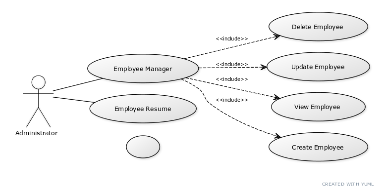
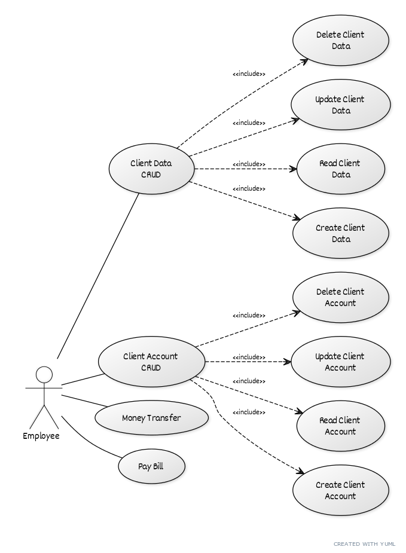
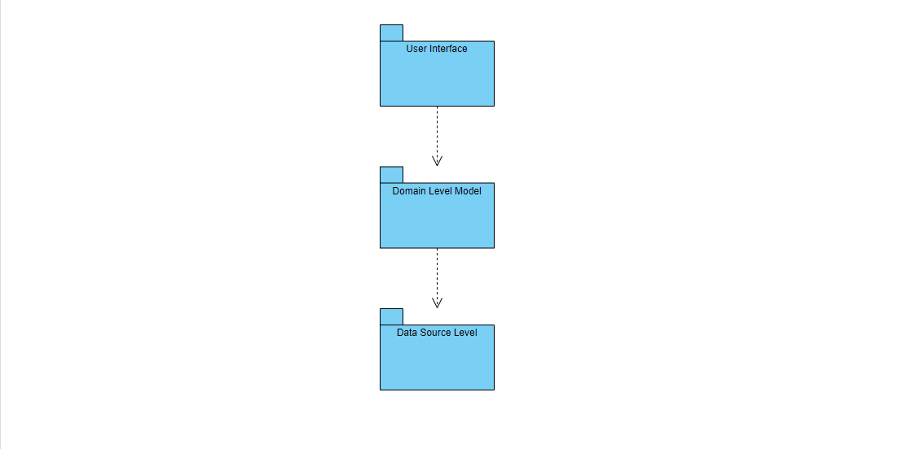
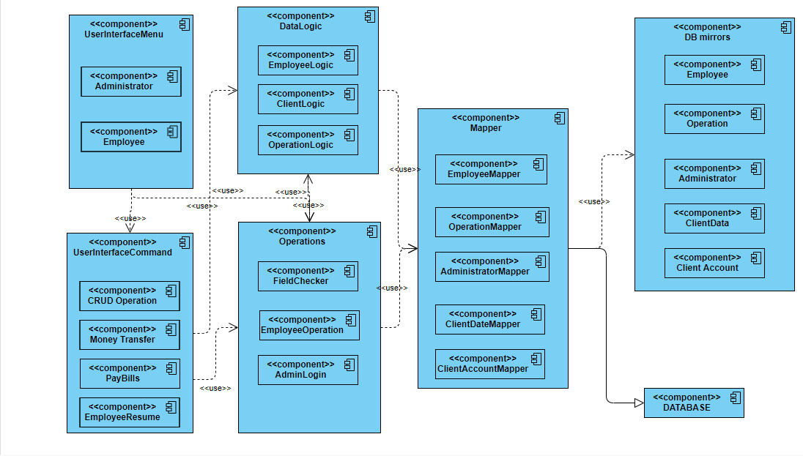
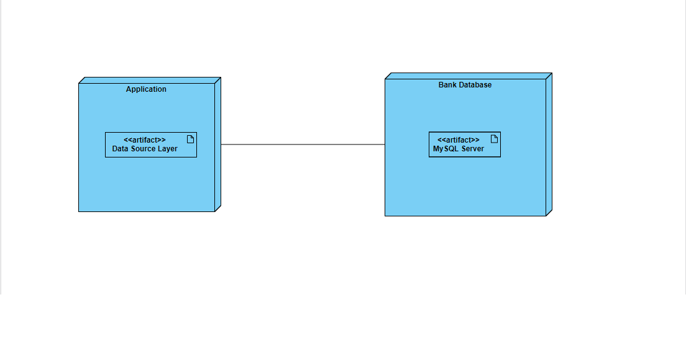
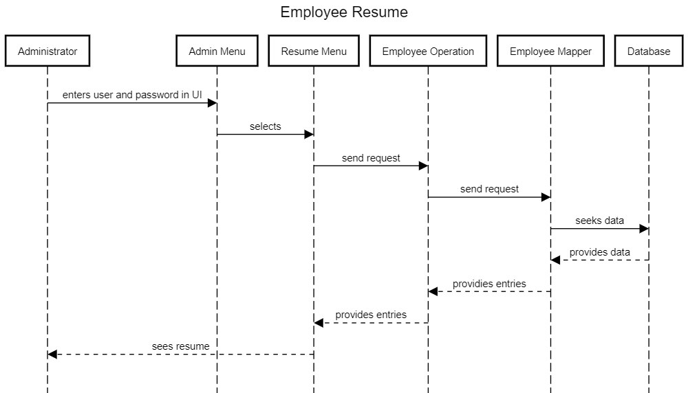
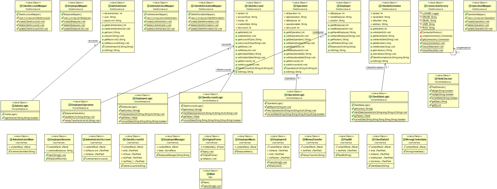

# Analysis and Design Document

# Requirement analysis

## Assignment Specification
This assignment specification is to design and implement an application for the front desk employees of a bank. The application should have two types of users (a regular user represented by the front desk employee and an administrator user) which have to provide a username and a password in order to use the application.

## Function requirements
 The application uses an user friendly interface to modify the data in a database used for a bank system. The application uses 2 menus, one for the administrator (secured with password) and other for employee. In each of the menu the user has his whole set of operation he can use to do his job. The username and password used for administrator stops the employee to use administrator menu. Administrator can make CRUD operations on employees data and also see the resume of any employee for a selected period of time. The employee can make CRUD operation on client information and client account and also make money transfer between accounts and pay bills for different utilities for the client. All the data that is used on this application is stored with every command to the database so the memory of the application won't be volatile.
 

## Non-functional Requirements
   - employees can't update their own profiles
   - the fields of the application are checked so the user don't introduces a wrong input of data
   - the application uses combo boxes filled with data already stored in database so when an operation like Update is easier and safer to use

# Use-Case Model

## Use case Admininistrator

    * Use case: use case goal
    * Level: one of: user-goal level
    * Primary actor: Administrator
    * Main success scenario: CRUD employee
    * Extensions: View Employee Resume
    
   

## Use case Employee

    * Use case: use case goal
    * Level: one of: user-goal level
    * Primary actor: Employee
    * Main success scenario: CRUD on Client Data
    * Extensions: CRUD on Client Account or Money Transfer or Pay Bill 

   

# System Architectural Design

## Architectural Pattern Description
The application has and Layered Architecture based on UI level, Bussines Domain and Data Domain. 

## Diagrams
Create the system’s conceptual architecture; use architectural patterns and describe how they are applied. Create package, component and deployment diagrams

For this aplication I used layered architectural pattern. Each of the layer uses a specific design pattern to manipulate the data.

# UML Sequence Diagrams

# Class Design

## Design Patterns Description
This application uses Domain Model Design pattern for Bussines Domanin Layer and Data Mapper design pattern for Data Source Layer. Domain model provides an object-oriented way of dealing with complicated logic. Instead of having one procedure that handles all business logic for a user action there are multiple objects and each of them handles a slice of domain logic that is relevant to it.
Each of the classes will incorporate both the data, mainly represented in form of attributes, and all the behaviour that is related to that data. Additionally, Domain Model objects are usually in a one-to-one relationship with records in database tables.
Data mapper layer of Mappers that moves data between objects and a database while keeping them independent of each other and the mapper itself. Mapper means an object that sets up communication between two independent objects.

## UML Class Diagram

# Data Model
Each of the specific data from a table of the database is storred in a specific array of a type that mirrrors the data from the database. The data flows from the database through mappers (data source layer) to the speicfic operations classes (Bussines Layer) and it's modified accordingly to the commands from the user interface specific windows(UI layer).

# System Testing
Present the used testing strategies (unit testing, integration testing, validation testing) and testing methods (data-flow, partitioning, boundary analysis, etc.).

In this particular application I used a few testing strategies: unit testing for diffferent functions and UI windows to see if they work properly, integration testing to test the connection to the database with CRUD operations and functional testing to test the whole application. The main testing method was data-flow. 

# Bibliography
- [Online diagram drawing software](https://yuml.me/) ([Samples](https://yuml.me/diagram/scruffy/class/samples))
- [Yet another online diagram drawing software](https://www.draw.io)
